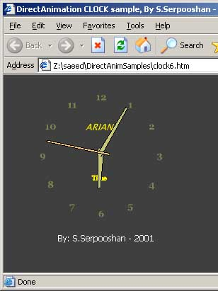



## Clock \(DirectAnim\. in Html\)

### Description

draw a animated clock using VBScript-DirectAnimation in an Html file!
 
### More Info
 

             |
---                |---
**Submitted On**   |2001-12-27 17:18:40
**By**             |[Saeed Serpooshan](https://github.com/Planet-Source-Code/PSCIndex/blob/master/ByAuthor/saeed-serpooshan.md)
**Level**          |Advanced
**User Rating**    |5.0 (40 globes from 8 users)
**Compatibility**  |VB 5\.0, VB 6\.0
**Category**       |[DirectX](https://github.com/Planet-Source-Code/PSCIndex/blob/master/ByCategory/directx__1-44.md)
**World**          |[Visual Basic](https://github.com/Planet-Source-Code/PSCIndex/blob/master/ByWorld/visual-basic.md)
**Archive File**   |[Clock\_\(Dir79223542002\.zip](https://github.com/Planet-Source-Code/saeed-serpooshan-clock-directanim-in-html__1-34442/archive/master.zip)

